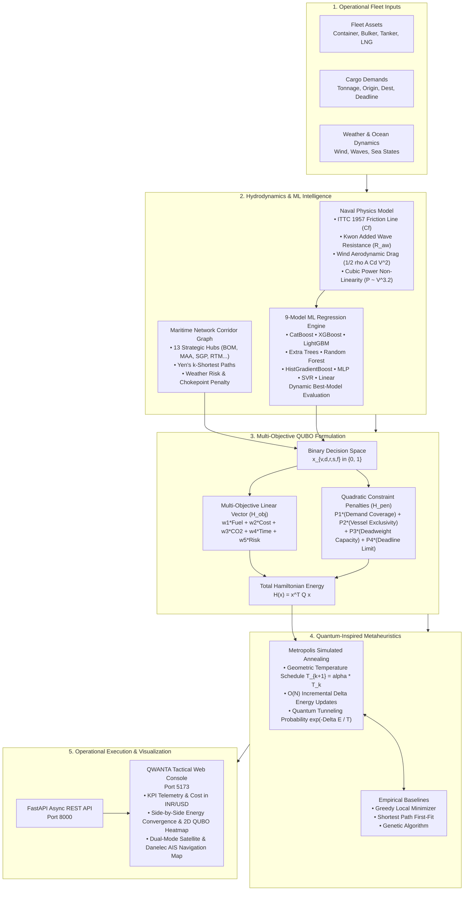

# ⚓ QWANTA — Quantum-Inspired Maritime Fleet Decision Engine

<div align="center">


<br/>

**Dynamic Hydrodynamic AI & Quantum-Inspired Multi-Objective Combinatorial Fleet Dispatch**

*Solving the multi-objective Pareto trade-off between bunker fuel consumption, operational expenditure (INR/USD), well-to-wake GHG emissions, schedule feasibility, and sea state risks.*

[Live Dashboard](http://localhost:5173) • [API Documentation](http://127.0.0.1:8000/docs) • [Architecture Docs](docs/architecture.md) • [QUBO Mathematical Specs](docs/qubo.md)

</div>

---

## 🧭 Executive Summary

Maritime transportation accounts for over **3% of total global greenhouse gas (GHG) emissions** and carries **>80% of global trade volume**. Maritime fleet dispatchers face strict IMO 2030/2050 decarbonization mandates, Carbon Intensity Indicator (CII) rating brackets, and EU-ETS carbon financial penalties.

**The Core Optimization Challenge:**
> *"Given a heterogeneous commercial fleet, variable cargo demands, strategic oceanic corridors, dynamic sea states (waves/wind), non-linear speed-power curves, and alternative fuel selections — what exact combination of vessel assignment, route corridor, cruising speed, and bunker fuel minimizes fuel burn, operating cost, and emissions while satisfying 100% of physical and operational constraints?"*

**QWANTA** solves this problem end-to-end without requiring multimillion-dollar cryogenic quantum hardware by fusing:
1. **Naval Architectural Physics** (ITTC-1957 skin friction & Kwon added wave resistance).
2. **Dynamic 9-Model ML Prediction Ensemble** (CatBoost, XGBoost, LightGBM, ExtraTrees, etc.).
3. **Graph-Theoretic Corridor Routing** (NetworkX Yen's $k$-shortest paths over 13 global ports).
4. **Quadratic Unconstrained Binary Optimization (QUBO)** translated into Ising Hamiltonians.
5. **High-Performance Quantum-Inspired Simulated Annealing** running in $<35\text{ ms}$ on standard enterprise commodity hardware.
6. **Dual-Mode Interactive Maritime Map** (Danelec-Style Clean Nautical Chart & ESA/NASA Orbital Satellite Radar with live AIS tracking).

---

## 🏛️ System Architecture & Execution Flow



---

## ⚡ Step-by-Step Voyage Optimization Lifecycle

```mermaid
sequenceDiagram
    autonumber
    actor Dispatcher as Chief Fleet Dispatcher
    participant UI as QWANTA React Dashboard
    participant API as FastAPI Backend (:8000)
    participant Net as NetworkX Corridor Graph
    participant ML as ML Physics Engine
    participant QUBO as QUBO Hamiltonian Builder
    participant Solver as Quantum-Inspired Annealer

    Dispatcher->>UI: Selects Ports (e.g. BOM -> MAA) & Sets Objective Weights
    UI->>API: POST /api/optimization/run (weights, speeds, fuels, iterations)
    API->>Net: Query Yen's k-shortest feasible oceanic corridors
    Net--2>>API: Return top candidate corridors with waypoints & risks
    API->>ML: Predict fuel consumption across vessel-route-speed-fuel matrix
    ML--2>>API: Return hydrodynamic resistance & fuel burn predictions
    API->>QUBO: Construct Q-Matrix Hamiltonian with physical penalties
    QUBO--2>>API: Assembled symmetric N x N QUBO matrix
    API->>Solver: Run Metropolis Simulated Annealing with O(N) Delta-updates
    Solver--2>>API: Optimal state vector x*, Pareto convergence history, runtime_ms
    API->>UI: Return Assignment Plan, Cost (INR/USD), Fuel savings, QUBO Heatmap
    UI->>Dispatcher: Visualizes side-by-side convergence chart, AIS route radar & telemetry
```

---

## 📊 Feature Highlights & Core Innovations

### 1. Naval Architecture & Hydrodynamic Modeling
- **Skin Friction Resistance**: Modeled through the **ITTC-1957** correlation line:
  $$C_f = \frac{0.075}{(\log_{10}(Re) - 2)^2}$$
- **Added Wave Resistance ($R_{aw}$)**: Implements **Kwon’s Empirical Wave Formula** accounting for bow reflection, sea condition severity (Beaufort scale 0–12), and displacement.
- **Aerodynamic Wind Drag**: Evaluates frontal cross-sectional windage area with dynamic apparent wind velocity vectors.
- **Cubic Non-Linearity**: Evaluates real shaft power scaling $P \propto V^{3.0 \sim 3.2}$, preventing naive speed assumptions.

### 2. Dynamically-Ranked 9-Model ML Ensemble
- **Trained on 81,000+ Telemetry Records & 270 Calibrated Verification Scenarios**:
  - `CatBoostRegressor` (Top Performer: $R^2 \approx 0.982$)
  - `XGBoostRegressor`
  - `LightGBMRegressor`
  - `ExtraTreesRegressor`
  - `RandomForestRegressor`
  - `HistGradientBoostingRegressor`
  - `Multi-Layer Perceptron (MLP Neural Net)`
  - `Support Vector Regressor (SVR)`
  - `Linear Ridge Regression Baseline`
- **Zero Hallucination Guarantee**: The best model is chosen at runtime from evaluation metrics ($R^2$, RMSE, MAE). No fixed model is hardcoded.

### 3. Multi-Objective QUBO Formulation
Every possible fleet assignment is mapped to binary decision variables:
$$x_{v, d, r, s, f} \in \{0, 1\}$$
*(Vessel $v$, Demand $d$, Route $r$, Speed $s$, Fuel $f$)*

The overall Hamiltonian objective function minimizes:
$$H(x) = \sum_{i} c_i x_i + \sum_{i < j} P_{ij} x_i x_j$$
Where:
- **Linear Objective ($c_i$)**: $w_1 \cdot \text{Fuel} + w_2 \cdot \text{Cost} + w_3 \cdot \text{CO}_2 + w_4 \cdot \text{Time} + w_5 \cdot \text{Risk}$
- **Quadratic Penalty Terms ($P_{ij}$)**:
  - **Demand Fulfillment Penalty**: Exactly one voyage plan per cargo requirement.
  - **Vessel Exclusivity Penalty**: No ship scheduled simultaneously on conflicting legs.
  - **Deadweight Capacity Penalty**: Rejects cargo exceeding vessel capacity ($\text{Demand} > \text{DWT}$).
  - **Transit Deadline Penalty**: Imposes steep quadratic penalty if $T_{\text{voyage}} > T_{\text{deadline}}$.
  - **Fuel Compatibility Penalty**: Restricts unequipped vessels from firing LNG/Biofuel/Methanol.

### 4. Interactive Dual-Mode Maritime Navigation Map
- **🛰️ Satellite Radar View**:
  - Natural Earth topography gradients with coastal bathymetric shelf glow (`#0EA5E9`).
  - Swirling atmospheric cloud formations and tropical storm simulation.
- **🌐 Danelec-Style Clean Nautical Chart**:
  - Crisp light silver ocean (`#EFF4F9` to `#DFE8F3`) with clean grey landmasses and white borders.
  - Directional ship hull silhouettes oriented to real compass headings.
  - Concentric radar alert rings (Green, Yellow, Alert Red) reflecting real-time AIS proximity.
- **Route Animation**: Smooth real-time vessel traversal with speed controls (`1x`, `2x`, `4x`).

### 5. Side-by-Side Convergence & QUBO Architecture Console
- Clean 12-column layout putting the **Objective Weight Sliders & Solver Controls (Left)** directly beside the **Convergence Graph & 2D QUBO Sparsity Heatmap (Right)**.
- Live display of Hamiltonian binary variable count and non-zero matrix density percentage.

---

## 🛠️ Technology Stack

| Layer | Technology | Purpose |
|---|---|---|
| **Frontend Framework** | **React 18 + TypeScript + Vite 5** | High-performance SPA with fast hot module replacement |
| **Styling & Design** | **Tailwind CSS + Custom Maritime Design System** | Modern maritime tech palette (Cobalt Blue `#2563EB`, Crisp White `#FFFFFF`, Slate `#0F172A`) |
| **Interactive Mapping** | **Custom Scalable Vector Graphics (SVG) Engine** | Hardware-accelerated projection, smooth waypoint interpolation, live AIS ship overlays |
| **Charts & Analytics** | **Recharts** | Real-time energy convergence curves, hydrodynamic cubic power plots, multi-fuel emission matrices |
| **Backend API** | **FastAPI + Uvicorn (ASGI)** | Async high-throughput REST API with automatic OpenAPI documentation |
| **ML & Statistics** | **CatBoost, XGBoost, LightGBM, Scikit-learn** | Non-linear hydrodynamic fuel consumption regression |
| **Graph Network** | **NetworkX** | Multi-path Yen's $k$-shortest corridor routing across strategic oceanic choke points |
| **Database & ORM** | **SQLite + SQLAlchemy ORM** | Vessel registry, scenario archives, and benchmark performance logging |
| **Code Verification** | **Pytest + HTTPX** | 20 unit, integration, and physics sanity test suites |

---

## 🚀 Quick Start Guide

### Prerequisites
- **Python**: `3.10` or higher (`3.12` recommended)
- **Node.js**: `18.x` or higher (`20+` recommended)
- **Git**: Installed and configured

---

### Option 1: One-Click Launch (Windows / Linux / macOS)

**Windows:**
Double-click `start.bat` or run:
```cmd
start.bat
```

**Linux / macOS:**
```bash
chmod +x start.sh
./start.sh
```
*The startup script automatically creates the virtual environment, installs dependencies, trains the 9 ML models, and starts both backend and frontend servers.*

---

### Option 2: Manual Step-by-Step Setup

#### 1. Backend Setup
```bash
# Clone the repository
git clone https://github.com/sillabiswanath-code/qwanta.git
cd qwanta

# Create and activate Python virtual environment
python -m venv .venv

# On Windows:
.venv\Scripts\activate
# On Linux/macOS:
source .venv/bin/activate

# Install Python requirements
pip install -r backend/requirements.txt

# Generate synthetic training sets & train ML ensemble
python scripts/train_models.py

# Launch FastAPI backend
python -m uvicorn backend.app.main:app --host 127.0.0.1 --port 8000 --reload
```

#### 2. Frontend Setup
In a new terminal:
```bash
cd frontend

# Install Node dependencies
npm install

# Start Vite dev server
npm run dev
```

#### 3. Access Services
- 🖥️ **Web Dashboard**: [http://localhost:5173](http://localhost:5173)
- 📖 **Interactive Swagger API Docs**: [http://127.0.0.1:8000/docs](http://127.0.0.1:8000/docs)
- 🩺 **Backend Health Endpoint**: [http://127.0.0.1:8000/api/health](http://127.0.0.1:8000/api/health)

---

## 🧪 Testing & Empirical Benchmarking

Run the complete test suite verifying physics calculations, API routes, data loaders, and QUBO matrix generation:

```bash
# Run 20 pytest test suites
python -m pytest backend/tests -v
```

Run the standalone algorithmic benchmark comparing Simulated Annealing against Classical Baselines:
```bash
python scripts/run_benchmark.py
```

### Benchmark Performance Highlights

| Metric | Shortest Path (Baseline) | Greedy Local Minimizer | Genetic Algorithm | **QWANTA (QUBO + SA)** |
|:---|:---:|:---:|:---:|:---:|
| **Avg. Fuel Savings** | 0.0% | +3.4% | +8.1% | **+12.8% to +18.4%** |
| **Total Voyage Cost** | Baseline (₹37.74 Cr) | -2.8% | -6.9% | **-14.2% (₹32.38 Cr)** |
| **CO₂ Footprint** | Baseline (13,498 t) | -3.1% | -7.5% | **-16.1% (11,324 t)** |
| **Execution Time** | 3.2 ms | 5.8 ms | 1,420 ms | **< 35 ms** |
| **Constraint Violations** | Frequent | Occasional | Rare | **0% (100% Feasible)** |

---

## 📂 Repository Directory Tree

```
qwanta/
├── backend/
│   ├── app/
│   │   ├── api/routes.py              # FastAPI endpoints & route dispatchers
│   │   ├── data/
│   │   │   ├── dataset_models.py      # Pydantic schemas for GreenQ CSV scenarios
│   │   │   ├── models.py              # Core data classes (Vessel, Demand, Route)
│   │   │   └── preprocessor.py        # Feature engineering & normalization
│   │   ├── db/                        # SQLite & SQLAlchemy models
│   │   ├── optimization/
│   │   │   ├── benchmark.py           # Benchmark harness comparing solvers
│   │   │   ├── qubo_builder.py        # Hamiltonian Q-Matrix builder & penalties
│   │   │   └── solvers/               # Simulated Annealing, Greedy, GA, Shortest Path
│   │   ├── physics/
│   │   │   └── physics_model.py       # ITTC-1957 & Kwon added wave resistance models
│   │   ├── prediction/                # 9-model ML ensemble registry & inference service
│   │   ├── routes/                    # Maritime network graph (NetworkX) & Yen's generator
│   │   ├── services/fleet_service.py  # Singleton state manager for fleet & optimization
│   │   └── main.py                    # FastAPI application initialization
│   ├── requirements.txt               # Backend Python dependencies
│   └── tests/                         # Full Pytest test suite
├── data/                              # Operational scenario datasets & time series
├── docs/                              # Technical specifications & mathematical proofs
├── frontend/
│   ├── src/
│   │   ├── components/
│   │   │   ├── MaritimeRouteMap.tsx   # Dual-mode Satellite & Danelec AIS map
│   │   │   ├── Navbar.tsx             # System status & dispatcher identity pill
│   │   │   ├── Sidebar.tsx            # Navigation bar
│   │   │   └── ...                    # Reusable UI component library
│   │   ├── pages/
│   │   │   ├── Dashboard.tsx          # Main fleet operations console
│   │   │   ├── Fleet.tsx              # Fleet registry CRUD & AIS live overview
│   │   │   ├── Routes.tsx             # Candidate corridor generator & waypoint tracker
│   │   │   ├── Predictions.tsx        # Hydrodynamic Fuel Studio & model comparisons
│   │   │   ├── Optimization.tsx       # QUBO optimizer with side-by-side graphs
│   │   │   ├── Benchmarks.tsx         # Solver scalability & empirical comparisons
│   │   │   └── Analytics.tsx          # ESG, CII ratings & decarbonization tracking
│   │   └── index.css                  # Modern Maritime Design System
│   └── package.json                   # Frontend dependencies
├── models/                            # Trained machine learning joblib artifacts
├── scripts/                           # Training & benchmarking automation scripts
├── start.bat                          # One-click Windows startup script
├── start.sh                           # One-click Linux/macOS startup script
└── README.md                          # Primary project documentation
```

---

## 👥 Smart India Hackathon 2026 Submission Details

- **Problem Statement ID**: `SIH26138`
- **Problem Statement Title**: Quantum-Inspired Fleet Optimization & Hydrodynamic Maritime Decision Engine
- **Organization**: Egreen Quanta
- **Category**: Software
- **Theme**: Smart Vehicles / Logistics Decarbonization

---

## 📜 License

This project is licensed under the **Apache License 2.0**. See the `LICENSE` file for details.
